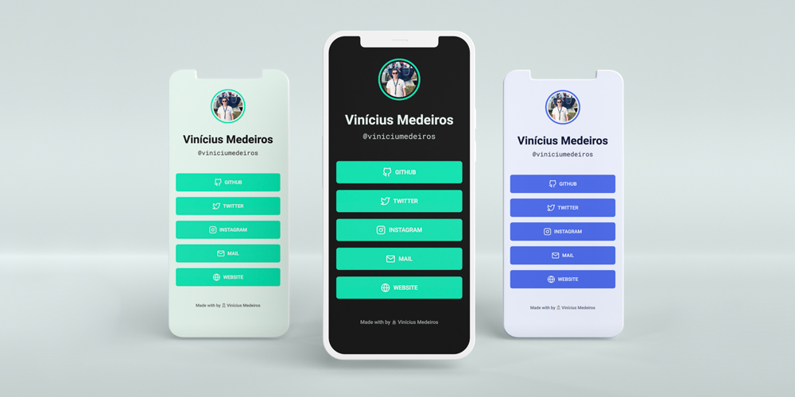

<h1 align="center">
  Share your Profile anywhere you like!
</h1>

<p align="center">
  

  

  <a href="https://www.linkedin.com/in/viniciumedeiros/">
    
  </a>

  <a href="https://github.com/viniciumedeiros/profile/commits/master">
    
  </a>

  
   <a href="https://github.com/viniciumedeiros/profile/stargazers">
    
  </a>
</p>
<p align="center">
  <a href="#-profile">Profile</a>&nbsp;&nbsp;&nbsp;|&nbsp;&nbsp;&nbsp;
  <a href="#-technologies">Technologies</a>&nbsp;&nbsp;&nbsp;|&nbsp;&nbsp;&nbsp;
  <a href="#-how-to-use">How to use</a>&nbsp;&nbsp;&nbsp;|&nbsp;&nbsp;&nbsp;
  <a href="#-how-to-contribute">How to contribute</a>&nbsp;&nbsp;&nbsp;|&nbsp;&nbsp;&nbsp;
  <a href="#-license">License</a>
</p>

## 💻 Profile

Profile is a single link that you can add to your bio on any social media platform.

<h1 align="center">
  
</h1>

## 🚀 Technologies

This project was developed with the following technologies:

- [HTML][html]
- [CSS][css]
- [Feather][feather]

## 🌍 How To Use

To clone and run this application.

From your command line:

### Install Profile

```bash
# Clone this repository
$ git clone https://github.com/viniciumedeiros/profile
# Go into the repository
$ cd profile/
```

### Set Theme
```html
<!-- Open the index.html file and set theme -->
1.  Blue: <body>
2.  Dark Blue: <body class="dark-blue">
3.  Green: <body class="green">
4.  Dark Green: <body class="dark-green">
```

## 👽 How to contribute

-  Make a fork;
-  Create a branch with your feature: `git checkout -b my-feature`;
-  Commit changes: `git commit -m 'feat: My new feature'`;
-  Make a push to your branch: `git push origin my-feature`.

After merging your receipt request to done, you can delete a branch from yours.

## 📃 License

This project is under the MIT license. See the [LICENSE](https://github.com/viniciumedeiros/profile/blob/master/LICENSE) for details.

🎓 Made with by Vinícius Medeiros 👨🏻‍💻 [Get in touch!](https://www.linkedin.com/in/viniciumedeiros/)

[html]: https://w3schools.com/html/
[css]: https://w3schools.com/css/
[feather]: https://feathericons.com